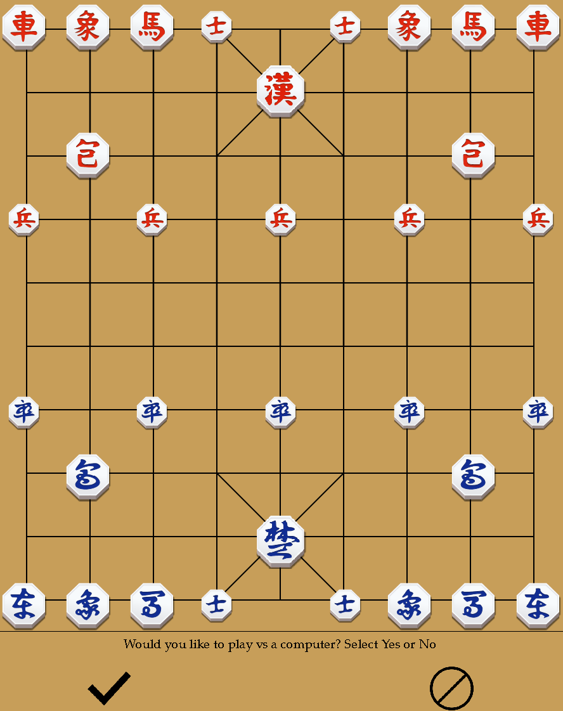

# Janggi - Korean Chess - a Python implementation

**Introduction**

This project is an implementation of the chess variant known as Janggi. The primary purpose of this project was to refine my OOP skills and also explore creating a basic GUI and AI.

For a detailed rule guide please see: https://en.wikipedia.org/wiki/Janggi

**Implementation Details**

Currently the entire game is implemented using Python. The backend logic follows OOP principles. I used Pygame for the GUI. The AI is very simple at the moment, it will simply attempt to capture the most valuable piece it is able to capture, or just move randomly if it has no capturable pieces.

**GUI Demo**

